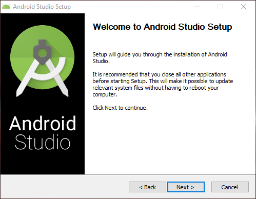

# Guide Book Installation Android Studio

* Download file __installasi Android Studio melalui link berikut: [https://developer.android.com/studio/](https://developer.android.com/studio/)
* Klik tombol DOWNLOAD ANDROID STUDIO

* Setelah klik tombol download, maka akan tampil ketentuan dan persyaratan Android Studio.
* Setelah membaca dan menyetujui persyaratan tersebut, silahkan checklist **"Saya telah membaca dan menyetujui ketentuan dan persyaratan di atas"** dan klik tombol DOWNLOAD ANDROID STUDIO FOR WINDOWS

* Setelah file Android Studio selesai didownload, untuk memulai proses installasi silahkan klik 2 kali pada file tersebut.

* Selanjutkan akan tampil **Welcome to Android Studio Setup** seperti gambar di bawah, dan klik Next.

* Pada tampilan pilihan komponen seperti gambar di bawah, biarkan default saja dan klik Next.

* Selanjutnya pilih lokasi install Android Studio, untuk pindah silahkan klik tombol browse. Jika ingin menggunakan settingan default silahkan langsung klik Next.

* Kemudian akan muncul pilihan **Start Menu Folder**, pada langkah ini biarkan secara default dan klik Install.

* Tunggu proses installasi selesai

* Ketika proses installasi selesai, silahkan klik Next.

* Setelah itu akan tampil yang menunjukkan bahwa Android Studio sudah selesai diinstall pada komputer. Silahkan checklist **Start Android Studio** dan klik Finish untuk menjalankan Android Studio dan menyelesaikan proses installasi.

* Jika ini pertama kali dalam installasi Android Studio di komputer, maka silahkan pilih **Do not import settings**. Namun jika sebelumnya sudah pernah menginstall Android Studio dan ingin mengembalikan settingan sebelumnya, maka bisa memilih **Previous version** atau **Config or installation folder**.

* Selanjutnya akan tampil Android Studio Setup Wizard, silahkan langsung klik Next.

* Pada pilihan **Install Type Android Studio** pilih yang **Standart**, dan klik Next.

* Pilih tema interface yang diinginkan

* Kemudian akan tampil **Verify Settings**, pada konfirmasi tersebut akan didownload sebesar 1,66 GB. Di dalamnya terdapat beberapa komponen, seperti **Android Emulator**, **Android SDK Build Tools**, **Android SDK Platform**, **dan lain-lain**. Silahkan langsung klik Finish untuk memulai download.

* Tunggu hingga proses download selesai. Untuk melihat secara detail, silahkan klik Show Details.

* Setelah proses download dan install komponen selesai, maka akan tampil seperti gambar di bawah, silahkan klik Finish.

* Android Studio akan terbuka dan siap digunakan.

Referensi:  
Bahan ajar Digital Talent Scholarship schema Junior Mobile Programmer 2019.

